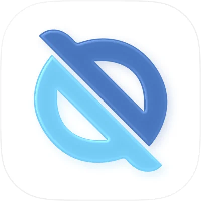
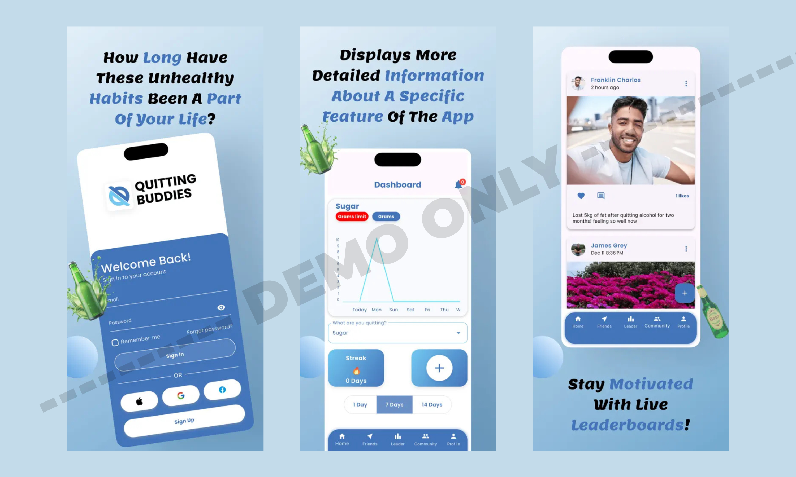
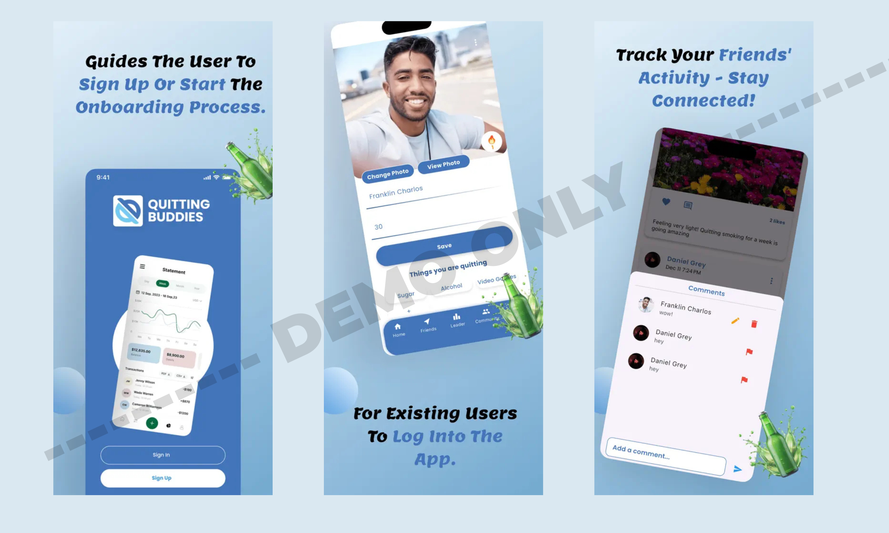

# 🚭 Quitting Buddies (For Demo Use Only)
### Industrial Portfolio — Feature Integration & Firebase Architecture  
**Note:** This application belongs to **Quitting Buddies** and was developed collaboratively with my junior developer.  
This repository is created **only for demo and presentation purposes** to showcase my contributions, UI previews, and technical involvement.

---

## 📌 About the App

**Quitting Buddies** is a habit-breaking social app available exclusively on the **Apple App Store**.  
The app helps users **quit bad habits** such as:

- 🚬 Smoking  
- 🍺 Alcohol consumption  
- 📱 Porn addiction  
- 🍳 Unhealthy lifestyle habits  
- ⚠️ Other negative behavioral patterns  

The platform motivates users by offering:

- 🔥 **Streak tracking** (daily habit progress)  
- 📈 **Progress graphs & analytics**  
- 📝 **Posting system** to share updates  
- 📍 **Nearby users feature** to connect with fellow quitters  
- 👫 **Community-driven encouragement**  

This demo repository contains **only UI previews**, no production code.

---

## 👨‍💻 My Role & Contributions

I supported this project in a senior capacity, contributing to multiple technical areas:

- 💳 **Guided and assisted with in-app purchases integration**  
- 🐞 **Helped fix core bugs in UI, logic, and flow**  
- 📤 **Assisted in preparing and launching the app on the App Store**  
- 🔥 **Designed and improved Firestore data structure** (Flutter + Firebase architecture)  
- 👨‍🏫 **Mentored my junior developer**, helping him complete complex modules  
- 📲 Ensured stable release performance and optimized state management  

This portfolio highlights the **Firebase architecture, feature contributions, and iOS launch support** I provided.

---

## 🧩 Demo Assets Included  

This repository contains **only the following items**:

- ✔ App Icon  
- ✔ Landscape showcase strips (multiple screens)  
- ❌ No source code  
- ❌ No backend logic  
- ❌ No private assets or schemas  

Everything is provided **strictly for visual demonstration**.

---

## 🖼️ Visual Preview

### **App Icon**

---

### **Showcase — Landscape Preview 1**

---

### **Showcase — Landscape Preview 2**

---

## 📥 Download (Official App Link)

> Note: This link belongs to the **official Quitting Buddies App**, not this portfolio demo.

**App Store:**  
[Available on Apple App Store](https://apps.apple.com/us/app/quitting-buddies/id6739349473)

**Google Play:**  
N/A (iOS-only release)

---

## 📄 Disclaimer

This repository is **not affiliated with, endorsed by, or officially representing Quitting Buddies or its owners**.  
It is intended **solely to demonstrate my technical contributions and UI involvement**.  
All rights to the original application belong to the **Quitting Buddies team**.

---

## 📬 Contact

For professional work, collaborations, or UI development:

**Email:** hamzabilalgaya.bilal@gmail.com  
**LinkedIn:** https://www.linkedin.com/in/hamza-bilal-g-4259a8181  
**Fiverr:** https://www.fiverr.com/s/EgZdxBK  
**Upwork:** https://www.upwork.com/freelancers/~01474d05eaa4a6e38b

---

## ⭐ Support My Work

If you like my work and want to support future UI components, tutorials, and open-source contributions:

### ☕ **Buy Me a Coffee**  

